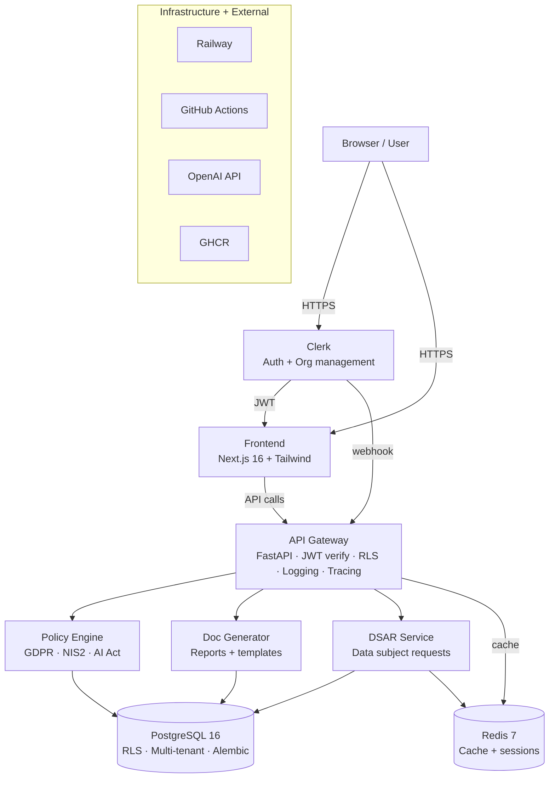

# ComplianceKit — System Architecture

## Diagram

## Services

- **API Gateway** — main entry point, handles auth, RLS, logging, tracing
- **Policy Engine** — GDPR, NIS2, AI Act compliance rules
- **Document Generator** — compliance reports and templates
- **DSAR Service** — data subject access requests

## Infrastructure

- **Railway** — production hosting
- **GitHub Actions** — CI/CD pipelines
- **GHCR** — container registry
- **OpenAI API** — AI features (Sprint 1+)
