# ComplianceKit — Database Schema

Complete database schema for the ComplianceKit platform. Every table is designed with multi-tenancy as a first-class concern — all tenant data is isolated at the database level via PostgreSQL Row Level Security (RLS).

---

## Schema Diagram

```mermaid
erDiagram

    TENANTS {
        uuid id PK
        string tenant_id UK
        string name
        string slug UK
        enum plan
        jsonb enabled_regulations
        jsonb assessment_config
        timestamp created_at
        timestamp updated_at
    }

    USERS {
        uuid id PK
        string user_id UK
        string tenant_id FK
        string tenant_name
        string email UK
        enum role
        jsonb permissions
        enum status
        string invited_by
        timestamp last_login_at
        timestamp created_at
        timestamp updated_at
    }

    COMPANY_PROFILES {
        uuid id PK
        string profile_id UK
        string tenant_id FK
        string tenant_name
        enum industry
        enum company_size
        enum b2b_or_b2c
        enum number_of_data_subjects
        string website_url
        string primary_jurisdiction
        boolean uses_cloud_services
        jsonb cloud_providers
        string primary_cloud_region
        boolean has_on_premise_servers
        jsonb certifications
        boolean has_compliance_officer
        string dpo_name
        string dpo_email
        string legal_contact_email
        jsonb data_categories_processed
        jsonb processing_purposes
        jsonb data_subject_categories
        date last_audit_date
        boolean previous_regulatory_action
        string regulatory_authority
        jsonb gdpr_data
        jsonb nis2_data
        jsonb ai_act_data
        boolean is_complete
        timestamp completed_at
        timestamp created_at
        timestamp updated_at
    }

    COMPANY_PROFILE_VERSIONS {
        uuid id PK
        string version_id UK
        string tenant_id FK
        string tenant_name
        string profile_id FK
        int version_number
        enum industry
        enum company_size
        jsonb gdpr_data
        jsonb nis2_data
        jsonb ai_act_data
        jsonb changed_fields
        string changed_by FK
        string change_reason
        timestamp created_at
    }

    REGULATIONS {
        uuid id PK
        string regulation_id UK
        string name
        string full_name
        text description
        string jurisdiction
        string authority
        string current_version
        date effective_date
        date review_date
        enum status
        string source_url
        timestamp last_checked_at
        timestamp created_at
        timestamp updated_at
    }

    REGULATION_VERSIONS {
        uuid id PK
        string version_id UK
        string regulation_id FK
        string version_number
        string version_label
        date effective_date
        date superseded_date
        text changes_summary
        jsonb changed_articles
        enum impact_level
        enum detected_by
        timestamp created_at
    }

    RULES {
        uuid id PK
        string rule_id UK
        string regulation_id FK
        string regulation_version_id FK
        string current_version_id FK
        string article
        int article_number
        string article_paragraph
        string title
        text description
        text plain_english
        enum severity
        string profile_field
        jsonb evaluation_logic
        text remediation_hint
        jsonb remediation_steps
        jsonb remediation_resources
        boolean applies_to_b2c
        boolean applies_to_b2b
        jsonb applies_to_sizes
        boolean requires_special_data
        boolean is_active
        timestamp deprecated_at
        timestamp created_at
        timestamp updated_at
    }

    RULE_VERSIONS {
        uuid id PK
        string version_id UK
        string rule_id FK
        string regulation_version_id FK
        int version_number
        string article
        text description
        text plain_english
        enum severity
        jsonb evaluation_logic
        text remediation_hint
        jsonb remediation_steps
        enum change_type
        text change_summary
        timestamp created_at
    }

    ASSESSMENTS {
        uuid id PK
        string assessment_id UK
        string tenant_id FK
        string tenant_name
        string regulation_id FK
        string regulation_name
        string regulation_version_id FK
        string regulation_version
        int score
        int previous_score
        int score_change
        enum status
        enum triggered_by
        int total_rules_evaluated
        int total_gaps_found
        int critical_gaps
        int high_gaps
        int medium_gaps
        int low_gaps
        string created_by FK
        timestamp created_at
        timestamp started_at
        timestamp completed_at
        timestamp updated_at
    }

    GAPS {
        uuid id PK
        string gap_id UK
        string tenant_id FK
        string tenant_name
        string assessment_id FK
        string rule_id FK
        string rule_version_id FK
        string article
        string rule_title
        string regulation_name
        enum severity
        int score_impact
        enum status
        text remediation_hint
        jsonb remediation_steps
        string resolved_by FK
        timestamp resolved_at
        text resolution_notes
        string accepted_risk_by FK
        timestamp accepted_risk_at
        text accepted_risk_reason
        timestamp accepted_risk_expires_at
        timestamp created_at
        timestamp updated_at
    }

    POLICIES {
        uuid id PK
        string policy_id UK
        string tenant_id FK
        string tenant_name
        string title
        enum type
        enum status
        string language
        int current_version
        text content
        boolean is_ai_enhanced
        string regulation_id FK
        string related_article
        string created_by FK
        string reviewed_by FK
        string approved_by FK
        timestamp approved_at
        date next_review_date
        timestamp created_at
        timestamp updated_at
    }

    POLICY_VERSIONS {
        uuid id PK
        string version_id UK
        string tenant_id FK
        string tenant_name
        string policy_id FK
        int version_number
        enum status
        string language
        string title
        text content
        boolean is_ai_enhanced
        text change_summary
        enum change_type
        jsonb changed_fields
        string created_by FK
        string reviewed_by FK
        string approved_by FK
        timestamp approved_at
        timestamp created_at
    }

    DSAR_REQUESTS {
        uuid id PK
        string dsar_id UK
        string tenant_id FK
        string tenant_name
        string subject_email
        string subject_name
        boolean subject_verified
        enum verification_method
        timestamp verified_at
        string verified_by FK
        enum type
        text description
        enum status
        timestamp deadline_at
        timestamp extended_deadline_at
        text extension_reason
        timestamp extension_notified_at
        int days_remaining
        string assigned_to FK
        timestamp assigned_at
        text response_notes
        timestamp response_sent_at
        enum rejection_reason
        text rejection_notes
        jsonb data_categories_found
        jsonb data_location
        timestamp withdrawn_at
        text withdrawal_reason
        timestamp created_at
        timestamp updated_at
        timestamp fulfilled_at
    }

    DOCUMENTS {
        uuid id PK
        string document_id UK
        string tenant_id FK
        string tenant_name
        string title
        enum type
        enum format
        string language
        string policy_id FK
        string policy_version_id FK
        string assessment_id FK
        string dsar_id FK
        string storage_url
        string storage_key
        int file_size_bytes
        string checksum
        string generated_by FK
        boolean is_ai_enhanced
        int generation_time_ms
        string template_used
        boolean is_public
        string access_url
        timestamp access_expires_at
        int download_count
        timestamp created_at
        timestamp expires_at
    }

    %% Relationships

    TENANTS ||--o{ USERS : "has many"
    TENANTS ||--o| COMPANY_PROFILES : "has one"
    TENANTS ||--o{ ASSESSMENTS : "has many"
    TENANTS ||--o{ POLICIES : "has many"
    TENANTS ||--o{ DSAR_REQUESTS : "has many"
    TENANTS ||--o{ DOCUMENTS : "has many"
    TENANTS ||--o{ GAPS : "has many"

    COMPANY_PROFILES ||--o{ COMPANY_PROFILE_VERSIONS : "has many"

    REGULATIONS ||--o{ REGULATION_VERSIONS : "has many"
    REGULATIONS ||--o{ RULES : "has many"
    REGULATIONS ||--o{ ASSESSMENTS : "has many"
    REGULATIONS ||--o{ POLICIES : "has many"

    REGULATION_VERSIONS ||--o{ RULES : "has many"
    REGULATION_VERSIONS ||--o{ RULE_VERSIONS : "has many"
    REGULATION_VERSIONS ||--o{ ASSESSMENTS : "has many"

    RULES ||--o{ RULE_VERSIONS : "has many"
    RULES ||--o{ GAPS : "has many"

    ASSESSMENTS ||--o{ GAPS : "has many"
    ASSESSMENTS ||--o{ DOCUMENTS : "has many"

    POLICIES ||--o{ POLICY_VERSIONS : "has many"
    POLICIES ||--o{ DOCUMENTS : "has many"

    DSAR_REQUESTS ||--o{ DOCUMENTS : "has many"
```



---

## Table Descriptions

### 1. tenants

**Purpose:** One row per company using ComplianceKit. The root of the entire data model — every other table with `tenant_id` belongs to a tenant.

**Key design decisions:**

- `enabled_regulations` JSONB controls which regulations the tenant has access to. Adding a new regulation requires no schema migration — just a new key in the JSON.
- `assessment_config` JSONB stores scheduling preferences. Flexible enough to add new config options without migrations.
- No compliance data here — that lives in `company_profiles`. Tenants is identity and billing only.

| Column              | Type   | Description                                      |
| ------------------- | ------ | ------------------------------------------------ |
| id                  | UUID   | Internal primary key, never exposed in API       |
| tenant_id           | STRING | Public ID e.g. `ten_4x7k9p2m`                    |
| name                | STRING | Company full name e.g. "Acme GmbH"               |
| slug                | STRING | URL-friendly name e.g. "acme-gmbh"               |
| plan                | ENUM   | free / pro / enterprise                          |
| enabled_regulations | JSONB  | `{"gdpr": true, "nis2": false, "ai_act": false}` |
| assessment_config   | JSONB  | `{"auto_run": false, "schedule": "monthly"}`     |

---

### 2. users

**Purpose:** One row per person who has access to a tenant account. Managed by Clerk for auth — this table mirrors Clerk user data and adds ComplianceKit-specific fields.

**Key design decisions:**

- `tenant_name` is denormalised here to avoid joins when displaying user lists.
- Invite lifecycle delegated to Clerk — no invite tokens stored here.
- `permissions` JSONB stores overrides from the default role permissions. Only changed fields are stored — the application code falls back to role defaults.

| Column      | Type   | Description                              |
| ----------- | ------ | ---------------------------------------- |
| user_id     | STRING | Public ID e.g. `usr_9m3kx7p1`            |
| tenant_id   | STRING | Which company this user belongs to       |
| tenant_name | STRING | Denormalised from tenants.name           |
| email       | STRING | Unique across the entire platform        |
| role        | ENUM   | admin / member / viewer                  |
| permissions | JSONB  | Custom permission overrides set by admin |
| status      | ENUM   | pending / active / suspended             |
| invited_by  | STRING | user_id of who sent the invite           |

---

### 3. company_profiles

**Purpose:** Stores everything about a company's compliance posture. This is the input to the gap analysis engine — every field maps to one or more regulation requirements.

**Key design decisions:**

- `gdpr_data`, `nis2_data`, `ai_act_data` are JSONB to allow adding new regulation-specific fields without schema migrations.
- Core fields (industry, size, jurisdiction) stay as typed columns because the gap engine filters rules based on them.
- `is_complete` gates gap analysis — engine only runs on completed profiles.
- Adding a new regulation (e.g. Data Act) = add a `data_act_data` JSONB column. One migration, then all future fields are flexible.

| Column                  | Type   | Description                                                                            |
| ----------------------- | ------ | -------------------------------------------------------------------------------------- |
| profile_id              | STRING | Public ID e.g. `cp_2kx7m9p1`                                                           |
| tenant_id               | STRING | Which company this profile belongs to                                                  |
| industry                | ENUM   | technology / healthcare / finance / legal / retail / education / manufacturing / other |
| company_size            | ENUM   | 1-10 / 11-50 / 51-200 / 201-1000 / 1000+                                               |
| b2b_or_b2c              | ENUM   | b2b / b2c / both                                                                       |
| number_of_data_subjects | ENUM   | under_1k / under_10k / under_100k / over_100k                                          |
| primary_jurisdiction    | STRING | Country code e.g. DE, FR, IE                                                           |
| gdpr_data               | JSONB  | 48 GDPR-specific compliance fields                                                     |
| nis2_data               | JSONB  | 40 NIS2-specific compliance fields                                                     |
| ai_act_data             | JSONB  | 40 EU AI Act-specific compliance fields                                                |
| is_complete             | BOOL   | Whether profile is complete enough to run analysis                                     |

---

### 4. company_profile_versions

**Purpose:** Full audit trail of every change to a company profile. Required for compliance — auditors ask "what was your data processing policy in January?"

**Key design decisions:**

- Complete snapshot approach — every version stores all fields, not just what changed. Slower to write but simple to read any historical state.
- `changed_fields` JSONB records which fields changed so the UI can show a diff without comparing two full snapshots.

| Column         | Type   | Description                                                   |
| -------------- | ------ | ------------------------------------------------------------- |
| version_id     | STRING | Public ID e.g. `cpv_xxx`                                      |
| profile_id     | STRING | Which profile this version belongs to                         |
| version_number | INT    | Increments with each change                                   |
| changed_fields | JSONB  | Which fields changed e.g. `["gdpr_data.has_dpo", "industry"]` |
| changed_by     | STRING | user_id who made the change                                   |
| change_reason  | STRING | Optional note explaining why                                  |

---

### 5. regulations

**Purpose:** Global registry of all regulations ComplianceKit supports. No tenant_id — regulations are shared across the entire platform.

**Key design decisions:**

- `status` controls what appears in the dashboard — `coming_soon` shows a locked card, `active` shows live data.
- `source_url` points to the official EU source for monitoring updates.
- Adding a new regulation = insert one row. No code changes needed.

| Column          | Type   | Description                                |
| --------------- | ------ | ------------------------------------------ |
| regulation_id   | STRING | Public ID e.g. `reg_xxx`                   |
| name            | STRING | GDPR / NIS2 / AI_ACT                       |
| full_name       | STRING | "General Data Protection Regulation"       |
| jurisdiction    | STRING | EU / UK / Global                           |
| authority       | STRING | "European Data Protection Board"           |
| current_version | STRING | Points to latest version e.g. "2024.1"     |
| status          | ENUM   | active / coming_soon / deprecated          |
| source_url      | STRING | Official source URL for monitoring updates |

---

### 6. regulation_versions

**Purpose:** History of every change to a regulation. Links regulations to the specific version rules and assessments were evaluated against.

**Key design decisions:**

- `superseded_date` marks when this version was replaced. Null means still active.
- `changed_articles` lets the system flag tenants: "Article 17 was updated — your assessment may be outdated."
- `detected_by` tracks whether the update was found manually or via automated monitoring.

| Column           | Type   | Description                                     |
| ---------------- | ------ | ----------------------------------------------- |
| version_id       | STRING | Public ID e.g. `rgv_xxx`                        |
| regulation_id    | STRING | Which regulation this version belongs to        |
| version_number   | STRING | e.g. "2018.1", "2024.1"                         |
| effective_date   | DATE   | When this version took effect                   |
| superseded_date  | DATE   | When replaced by newer version, null if current |
| changed_articles | JSONB  | `["Article 5", "Article 17"]`                   |
| impact_level     | ENUM   | minor / moderate / major                        |
| detected_by      | ENUM   | manual / automated / partner_feed               |

---

### 7. rules

**Purpose:** Every individual compliance requirement across all regulations. This is the brain of the gap engine — it tells the engine what to check, how to check it, and how serious a failure is.

**Key design decisions:**

- `evaluation_logic` JSONB allows complex conditional rules without code changes. New rules can be added by inserting data, not writing Python.
- `applies_to_*` fields filter rules so companies aren't penalised for rules that don't apply to them (e.g. SME exemptions).
- `plain_english` keeps legal jargon out of the UI — customers see simple explanations, not article text.

| Column                | Type   | Description                                             |
| --------------------- | ------ | ------------------------------------------------------- |
| rule_id               | STRING | Public ID e.g. `rul_xxx`                                |
| regulation_id         | STRING | Which regulation this rule belongs to                   |
| regulation_version_id | STRING | Which regulation version introduced this rule           |
| current_version_id    | STRING | Shortcut to latest rule_version                         |
| article               | STRING | e.g. "Article 37"                                       |
| severity              | ENUM   | critical / high / medium / low                          |
| profile_field         | STRING | Which company_profiles field to evaluate                |
| evaluation_logic      | JSONB  | How to evaluate the rule                                |
| remediation_hint      | TEXT   | What to do to fix this gap                              |
| applies_to_b2c        | BOOL   | Whether rule applies to B2C companies                   |
| applies_to_b2b        | BOOL   | Whether rule applies to B2B companies                   |
| applies_to_sizes      | JSONB  | Which company sizes this rule applies to                |
| requires_special_data | BOOL   | Only applies if company processes special category data |

---

### 8. rule_versions

**Purpose:** History of every change to a rule. Ensures assessments are permanently linked to the exact rule text that was active when they ran.

**Key design decisions:**

- `change_type` determines what action to take — `text_update` needs no reassessment, `logic_change` triggers full reassessment for all tenants.
- Complete snapshot — stores all rule fields at the time of the version, not just what changed.

| Column                | Type   | Description                                                          |
| --------------------- | ------ | -------------------------------------------------------------------- |
| version_id            | STRING | Public ID e.g. `rlv_xxx`                                             |
| rule_id               | STRING | Which rule this version belongs to                                   |
| regulation_version_id | STRING | Which regulation version this rule version belongs to                |
| version_number        | INT    | Increments with each change                                          |
| change_type           | ENUM   | text_update / severity_change / logic_change / new_rule / deprecated |
| evaluation_logic      | JSONB  | Snapshot of evaluation logic at this version                         |

---

### 9. assessments

**Purpose:** One row per compliance check run for a tenant. Stores the score, gap counts, and links to the exact regulation version evaluated against.

**Key design decisions:**

- `regulation_version_id` permanently stamps which version of the regulation was active. Future regulation updates don't retroactively change historical assessments.
- `previous_score` and `score_change` are pre-calculated so the dashboard can show trends without querying previous assessments.
- Gap counts (`critical_gaps`, `high_gaps` etc) are denormalised for fast dashboard queries.

| Column                | Type   | Description                              |
| --------------------- | ------ | ---------------------------------------- |
| assessment_id         | STRING | Public ID e.g. `ast_xxx`                 |
| tenant_id             | STRING | Which company this assessment belongs to |
| regulation_id         | STRING | Which regulation was assessed            |
| regulation_version_id | STRING | Which version was active when this ran   |
| score                 | INT    | Compliance score 0-100                   |
| previous_score        | INT    | Score from previous assessment           |
| score_change          | INT    | Delta e.g. +5, -3                        |
| triggered_by          | ENUM   | manual / scheduled / profile_change      |
| total_gaps_found      | INT    | Total gaps found                         |
| critical_gaps         | INT    | Number of critical gaps                  |
| high_gaps             | INT    | Number of high gaps                      |

---

### 10. gaps

**Purpose:** Every individual compliance failure found in an assessment. Drives the gap list on the dashboard and the remediation workflow.

**Key design decisions:**

- `rule_version_id` links to the exact rule version that found this gap — future rule updates don't change historical gap records.
- `article`, `rule_title`, `regulation_name` are denormalised so the gap remains readable even if the rule is later updated.
- `accepted_risk` allows companies to formally acknowledge a gap with a reason and expiry — legally important for documented risk decisions.
- `accepted_risk_expires_at` forces periodic review of accepted risks — they can't be accepted indefinitely.

| Column                   | Type      | Description                                  |
| ------------------------ | --------- | -------------------------------------------- |
| gap_id                   | STRING    | Public ID e.g. `gap_xxx`                     |
| assessment_id            | STRING    | Which assessment found this gap              |
| rule_id                  | STRING    | Which rule was failed                        |
| rule_version_id          | STRING    | Exact rule version at time of assessment     |
| severity                 | ENUM      | critical / high / medium / low               |
| score_impact             | INT       | Points deducted e.g. -15, -8, -4, -1         |
| status                   | ENUM      | open / resolved / accepted_risk / superseded |
| accepted_risk_expires_at | TIMESTAMP | When accepted risk must be reviewed          |

---

### 11. policies

**Purpose:** Compliance documents a company creates — privacy notices, RoPA, DPAs etc. The gap engine checks for active policies to auto-close related gaps.

**Key design decisions:**

- `regulation_id` links each policy to the regulation it satisfies — enables the gap engine to auto-close gaps when the right policy exists.
- `next_review_date` drives the deadline reminders widget.
- `is_ai_enhanced` tracks AI involvement for audit purposes.

| Column           | Type   | Description                                                                                              |
| ---------------- | ------ | -------------------------------------------------------------------------------------------------------- |
| policy_id        | STRING | Public ID e.g. `pol_xxx`                                                                                 |
| type             | ENUM   | privacy_notice / ropa / dpa / cookie_policy / data_retention / incident_response / ai_governance / other |
| status           | ENUM   | draft / active / under_review / archived                                                                 |
| regulation_id    | STRING | Which regulation this policy satisfies                                                                   |
| related_article  | STRING | e.g. "Article 13"                                                                                        |
| current_version  | INT    | Points to latest version number                                                                          |
| is_ai_enhanced   | BOOL   | Whether AI was used to generate/improve                                                                  |
| next_review_date | DATE   | When this policy needs reviewing                                                                         |
| approved_by      | STRING | user_id who approved this policy                                                                         |

---

### 12. policy_versions

**Purpose:** Full version history of every policy. Auditors can see exactly what a policy said on any given date.

**Key design decisions:**

- Each version has its own approval record — the system knows which version was last formally approved.
- `change_type` categorises the reason for the new version.
- Documents table links to `policy_version_id` — generated PDFs are permanently linked to the exact version they were generated from.

| Column         | Type   | Description                                          |
| -------------- | ------ | ---------------------------------------------------- |
| version_id     | STRING | Public ID e.g. `ver_xxx`                             |
| policy_id      | STRING | Which policy this version belongs to                 |
| version_number | INT    | Increments with each change                          |
| content        | TEXT   | Full policy text at this version                     |
| change_type    | ENUM   | created / edited / ai_enhanced / approved / archived |
| changed_fields | JSONB  | Which fields changed                                 |
| approved_by    | STRING | user_id who approved this version                    |

---

### 13. dsar_requests

**Purpose:** Full lifecycle management of Data Subject Access Requests. Tracks every DSAR from intake to fulfilment with GDPR-compliant deadline enforcement.

**Key design decisions:**

- `deadline_at` is always 30 days from `created_at` per GDPR Article 12.
- `extended_deadline_at` supports the 2-month extension allowed under Article 12(3).
- `extension_notified_at` proves the subject was notified of the extension within 1 month — a specific GDPR requirement.
- `days_remaining` is a calculated field updated daily by a background job — fast dashboard queries.
- `rejection_reason` is an enum — GDPR only allows rejection for specific legal reasons.

| Column                | Type      | Description                                                                   |
| --------------------- | --------- | ----------------------------------------------------------------------------- |
| dsar_id               | STRING    | Public ID e.g. `dsr_xxx`                                                      |
| type                  | ENUM      | access / deletion / portability / rectification / restriction / objection     |
| status                | ENUM      | pending / verified / processing / fulfilled / rejected / extended / withdrawn |
| deadline_at           | TIMESTAMP | 30 days from created_at                                                       |
| extended_deadline_at  | TIMESTAMP | Up to 2 extra months                                                          |
| days_remaining        | INT       | Calculated daily by background job                                            |
| rejection_reason      | ENUM      | cannot_verify_identity / manifestly_unfounded / excessive / not_applicable    |
| data_categories_found | JSONB     | What data was found about the subject                                         |
| data_location         | JSONB     | Where data was found                                                          |

---

### 14. documents

**Purpose:** Every generated compliance document — PDFs, DOCX files, Markdown exports. Links back to the exact source (policy version, assessment, or DSAR) it was generated from.

**Key design decisions:**

- `policy_version_id` links to the exact policy version used — the document can be reproduced identically even after the policy is updated.
- `checksum` enables file integrity verification — proves a document hasn't been tampered with.
- `is_public` marks documents like privacy notices that must be publicly accessible.
- `access_url` is a signed URL with expiry — secure sharing without making storage buckets public.
- Documents can come from three sources — policy (policy_id set), assessment (assessment_id set), or DSAR (dsar_id set).

| Column            | Type      | Description                                                                                                                                  |
| ----------------- | --------- | -------------------------------------------------------------------------------------------------------------------------------------------- |
| document_id       | STRING    | Public ID e.g. `doc_xxx`                                                                                                                     |
| type              | ENUM      | ropa / privacy_notice / dpa / cookie_policy / data_retention / incident_response / ai_governance / dsar_response / assessment_report / other |
| format            | ENUM      | pdf / docx / markdown                                                                                                                        |
| policy_version_id | STRING    | Exact policy version used to generate                                                                                                        |
| assessment_id     | STRING    | Assessment this document was generated from                                                                                                  |
| dsar_id           | STRING    | DSAR this document was generated for                                                                                                         |
| checksum          | STRING    | File integrity hash                                                                                                                          |
| is_public         | BOOL      | Whether publicly accessible                                                                                                                  |
| access_url        | STRING    | Signed URL for download                                                                                                                      |
| access_expires_at | TIMESTAMP | When signed URL expires                                                                                                                      |
| download_count    | INT       | Number of times downloaded                                                                                                                   |
| expires_at        | TIMESTAMP | When document itself expires                                                                                                                 |

---

## Relationships Summary

```
tenants
├── users                       (one tenant has many users)
├── company_profiles            (one tenant has one profile)
│   └── company_profile_versions (one profile has many versions)
├── assessments                 (one tenant has many assessments)
│   └── gaps                    (one assessment has many gaps)
├── policies                    (one tenant has many policies)
│   └── policy_versions         (one policy has many versions)
├── dsar_requests               (one tenant has many DSARs)
└── documents                   (one tenant has many documents)

regulations (global — no tenant_id)
├── regulation_versions         (one regulation has many versions)
└── rules                       (one regulation has many rules)
        └── rule_versions       (one rule has many versions)

assessments
└── gaps → rules                (gaps reference the rule that was failed)

documents
├── → policy_versions           (generated from a policy version)
├── → assessments               (generated from an assessment)
└── → dsar_requests             (generated for a DSAR response)
```

---

## Prefixed Public IDs

All public IDs use nanoid with a prefix for instant identification:

| Prefix | Table                    | Example        |
| ------ | ------------------------ | -------------- |
| `ten_` | tenants                  | `ten_4x7k9p2m` |
| `usr_` | users                    | `usr_9m3kx7p1` |
| `pro_` | company_profiles         | `pro_2kx7m9p1` |
| `cpv_` | company_profile_versions | `cpv_3mx9k7p2` |
| `reg_` | regulations              | `reg_7p2m9k3x` |
| `rgv_` | regulation_versions      | `rgv_1k9x7m2p` |
| `rul_` | rules                    | `rul_5m2p9k7x` |
| `rlv_` | rule_versions            | `rlv_8k3x2m9p` |
| `ast_` | assessments              | `ast_4p7k2x9m` |
| `gap_` | gaps                     | `gap_2x9m7k3p` |
| `pol_` | policies                 | `pol_7m3k9x2p` |
| `ver_` | policy_versions          | `ver_9k2p7m3x` |
| `dsr_` | dsar_requests            | `dsr_3p9x2k7m` |
| `doc_` | documents                | `doc_6m7k3x9p` |

Raw UUIDs are never exposed in API responses. All external references use these prefixed IDs.

---

## Multi-tenancy

Every table with tenant data has a `tenant_id` column. PostgreSQL Row Level Security (RLS) policies enforce isolation at the database layer — not just the application layer. Even if application code has a bug that fetches the wrong data, the database will return zero rows.

The only tables without `tenant_id` are global reference tables: `regulations`, `regulation_versions`, `rules`, `rule_versions`. These are shared across all tenants and are read-only for tenants.
